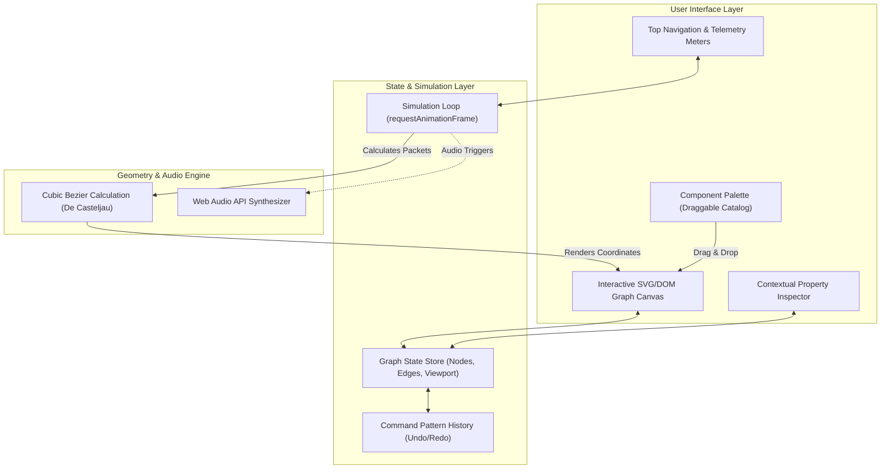

<div align="center">

# ⚡ GraphFlow

### Interactive Distributed Architecture & Real-Time Data Flow Simulator

[](https://reactjs.org/)
[](https://www.typescriptlang.org/)
[](https://vitejs.dev/)
[](https://tailwindcss.com/)
[](https://vitest.dev/)
[](https://opensource.org/licenses/MIT)

**GraphFlow** is a browser-based, high-performance visual architecture design and data flow simulation engine. It empowers developers and architects to design distributed systems (gateways, microservices, caches, message queues, databases) and simulate real-time traffic, latency, network errors, and throughput with animated packets moving along cubic bezier curves.

[Live Demo](#) · [Report Bug](#) · [Request Feature](#)

</div>

---

## 🌟 Key Engineering Highlights

* **Pure Native Mathematics (Zero External Canvas Dependencies):** Dynamic cubic bezier curves ($B(t)$ De Casteljau evaluation) rendered cleanly with native SVG and DOM nodes for maximum performance and 60 FPS fluidity.
* **Decoupled Simulation Engine:** A tick-based `requestAnimationFrame` loop animating packets along edge tangents, computing live throughput (RPS), jitter, and service latency.
* **Fault Injection & Chaos Engineering:** Configurable error rates and latency across nodes and pipelines, with visual failure packets (HTTP 500) and retry routes.
* **Command Pattern History Stack:** Production-grade Undo/Redo stack with keyboard shortcuts (`Ctrl+Z`, `Ctrl+Y`).
* **Pre-Configured Architecture Archetypes:**
  - 🛒 *E-Commerce Distributed System* (API Gateway $\rightarrow$ Order/Auth Services $\rightarrow$ Redis $\rightarrow$ Kafka $\rightarrow$ Payment Processor $\rightarrow$ Stripe)
  - 🤖 *AI RAG Pipeline* (React Client $\rightarrow$ FastAPI Gateway $\rightarrow$ Vector Database $\rightarrow$ Gemini LLM $\rightarrow$ S3 Storage)
  - ⚡ *Real-Time WebSocket Cluster* (Browser Clients $\rightarrow$ HAProxy Load Balancer $\rightarrow$ Socket Nodes $\rightarrow$ Redis Pub/Sub)
* **One-Click Export & Documentation Generator:** Generates production-ready Markdown specifications with embedded Mermaid diagrams for your project's `README.md`.
* **Subtle Synthesized Audio (Web Audio API):** Interactive tactile sound effects for node connections, packet transmissions, and traffic spikes (fully toggleable).

---

## 🛠️ Architecture & Data Flow



---

## 🚀 Quick Start

### Prerequisites
* Node.js (v18 or higher)
* npm / pnpm / yarn

### Installation
```bash
# Clone the repository
git clone https://github.com/your-username/graphflow.git

# Navigate into project directory
cd graphflow

# Install dependencies
npm install

# Start development server
npm run dev
```

Visit `http://localhost:5173` in your browser.

---

## 🧪 Automated Testing
GraphFlow includes comprehensive unit tests verifying the bezier geometry engine, packet positioning, and documentation generators.

```bash
# Run test suite
npm test
```

---

## ⌨️ Keyboard Shortcuts

| Shortcut | Action |
| :--- | :--- |
| `Ctrl + Z` / `Cmd + Z` | Undo last graph modification |
| `Ctrl + Y` / `Cmd + Y` | Redo action |
| `Delete` / `Backspace` | Remove selected node or connection |
| `Escape` | Deselect active component |
| `Mouse Drag` | Pan infinite canvas |
| `Mouse Wheel` | Zoom in / out (30% to 250%) |

---

## 💼 LinkedIn Showcase Template

Copy and customize this post to share your project on LinkedIn:

```markdown
🚀 Excited to share my latest engineering project: GraphFlow – an interactive Distributed Architecture & Real-Time Data Flow Simulator!

Building distributed systems requires thinking through latency, throughput bottlenecks, and fault tolerance. I built GraphFlow to make system design tangible and interactive.

Key features:
✨ Custom SVG & Cubic Bezier rendering engine built from scratch (no heavy canvas dependencies).
⚡ Real-time traffic simulation running on requestAnimationFrame at 60 FPS.
💥 Live chaos engineering: inject error rates, latency spikes, and simulate DDoS loads.
🔄 Command pattern Undo/Redo stack with full keyboard accessibility.
📄 One-click export to Mermaid diagrams and Markdown architecture specifications.

Built with: React 18, TypeScript, Tailwind CSS, Vite, and Vitest.

Check out the live demo: [YOUR_VERCEL_LINK]
GitHub repository: [YOUR_GITHUB_LINK]

I’d love to hear your feedback! What architectural pattern would you like to see simulated next?

#SoftwareEngineering #SystemDesign #React #TypeScript #WebDevelopment #Frontend #OpenSource
```

---

## 📄 License
This project is open-source and available under the [MIT License](LICENSE).
