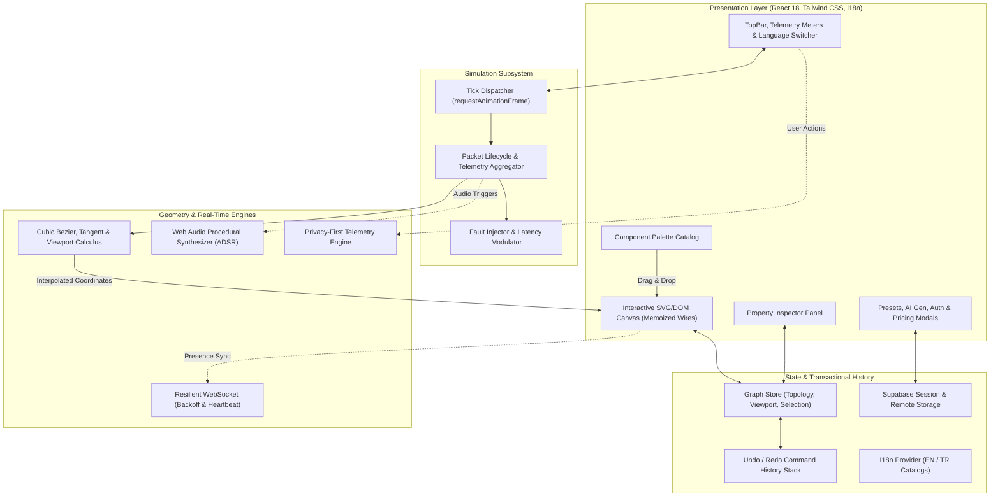

<div align="center">

# GraphFlow

**Interactive distributed systems modeler and real-time data flow simulator.**

[](LICENSE)
[](https://www.typescriptlang.org/)
[](https://react.dev/)
[](https://vite.dev/)
[](https://tailwindcss.com/)
[](https://github.com/Hanubaki/GraphFlow/actions/workflows/ci.yml)
[](docker-compose.yml)

<p align="center">
  <a href="#overview">Overview</a> •
  <a href="#architecture">Architecture</a> •
  <a href="#core-capabilities">Capabilities</a> •
  <a href="#architecture-archetypes">Archetypes</a> •
  <a href="#getting-started">Getting Started</a> •
  <a href="#testing--verification">Testing</a> •
  <a href="#directory-structure">Structure</a> •
  <a href="#license">License</a>
</p>

</div>

---

## Overview

Static diagramming tools (such as draw.io, Lucidchart, and Miro) represent system topologies as inert boxes and lines. They do not simulate dynamic runtime characteristics:

- Downstream saturation and latency compounding when ingress traffic scales
- Backpressure propagation through asynchronous event buffers (such as Apache Kafka and RabbitMQ)
- Cascading timeouts, circuit-breaker tripping, and cache-miss stampedes under degraded node states
- Transactional consistency boundaries across command/query separations (CQRS) and distributed outbox logs

GraphFlow models distributed architectures as dynamic, stateful topologies with an integrated client-side simulation engine. Topologies are composed on an infinite canvas, connected through cubic bezier paths, and evaluated with simulated traffic streams. Packets traverse edges according to computed velocities and latency curves, with real-time aggregation of throughput (requests per second), network jitter, error rates, and dropped payloads.

---

## Core Capabilities

### Native Vector Calculus & De Casteljau Evaluation
All edge curves and packet positions are evaluated using pure Bernstein polynomial forms of cubic bezier curves:

$$B(t) = (1-t)^3 P_0 + 3(1-t)^2 t P_1 + 3(1-t) t^2 P_2 + t^3 P_3, \quad t \in [0, 1]$$

Coordinates, velocity tangents ($B'(t)$), and normal vectors are computed directly against native SVG paths and DOM elements. The implementation avoids heavy third-party canvas runtimes (such as PixiJS, Fabric.js, or Konva), keeping asset payload minimal and maintaining 60 FPS frame rates.

### Decoupled Simulation Subsystem
Simulation mechanics run on a non-blocking `requestAnimationFrame` tick loop separated from React's component reconciliation cycle via `SimulationContext`:
- **Packet Lifecycle Management:** Ingress queues, velocity calculations, and arrival callbacks are scheduled and resolved per tick.
- **Micro-Component Separation:** High-frequency rendering is isolated to `PacketDot` layers, preventing full canvas re-renders during 60 FPS packet travel.
- **Real-Time Telemetry:** Continuous rolling calculations for aggregate RPS, average end-to-end latency, and jitter variance.

### Fault Injection & Chaos Testing
- **Per-Node Degradation:** Configure latency overhead and failure probability ($[0.0, 1.0]$) across individual compute, storage, or external nodes.
- **Error Packet Routing:** Requests failing status checks transition to 5xx error states and highlight retry loops or dead-letter sinks.
- **Traffic Modulation:** Inject instantaneous burst spikes to analyze queue saturation and node backpressure.

### Resilient Real-Time Networking
The `ResilientSocket` client ensures bulletproof WebSocket state synchronization:
- **Jittered Exponential Backoff:** Reconnection intervals scatter across randomized windows ($[1\text{s}, 30\text{s}]$) to prevent thundering herd conditions.
- **Heartbeat & Zombie Detection:** Periodic 30-second ping/pong frames detect half-open sockets caused by network drops and force reconnections.
- **Offline Message Buffer:** Outgoing state envelopes are queued in a bounded memory buffer and flushed in chronological sequence upon reconnection.

### Procedural Web Audio Synthesis
Synthesizes acoustic feedback natively via the Web Audio API without external audio assets:
- **Node Lifecycle Sounds:** Dual-tone frequency sweeps ($C_5 \rightarrow E_5$) for node instantiation; downward triangle tones for deletion.
- **Major Arpeggios:** Three-tone chord synthesis ($C_5 \rightarrow E_5 \rightarrow G_5$) upon architecture export, preset load, or checkout success.
- **ADSR Exponential Envelopes:** Ramps gain values exponentially to eliminate speaker pops and clicks.

### Multi-Language (i18n) Localization
Structured dictionary catalogs for English (`en`) and Turkish (`tr`):
- Dynamic one-click language switcher in the primary navigation toolbar.
- Automatic browser locale detection (`navigator.language`) and persistent `localStorage` synchronization.
- Complete coverage across toolbar actions, component palette categories, inspector panels, and dialogue modals.

### Privacy-First Product Telemetry
Standardized `[Object] [Action]` analytical event taxonomy (`Node Created`, `Simulation Toggled`, `Modal Opened`, `Checkout Clicked`):
- In-memory event buffer with subscriber observer interfaces.
- Zero-PII sanitization engine strips sensitive credentials, tokens, and emails before dispatch.
- Non-blocking network dispatches via `navigator.sendBeacon()`.

### Enterprise Security & RFC 7807 Standardization
- **RFC 7807 Problem Details:** Standardized, machine-readable HTTP error envelopes (`type`, `title`, `status`, `detail`, `instance`).
- **Webhook Idempotency:** 24-hour TTL memory deduplication engine prevents duplicate billing event mutations.
- **Rate-Limiting Headers:** Emits standard `Retry-After`, `X-RateLimit-Limit`, `X-RateLimit-Remaining`, and `X-RateLimit-Reset` headers.
- **Content Security Policy (CSP):** Synchronized between Vercel deployments (`vercel.json`) and unprivileged Nginx Docker containers (`nginx.conf`).

---

## Architecture



---

## Architecture Archetypes

GraphFlow includes verified archetypes modeling mission-critical distributed patterns:

| Archetype | Topology & Nodes | Simulated Characteristics |
| :--- | :--- | :--- |
| **Transactional Outbox & CQRS** | Client $\rightarrow$ Envoy Gateway $\rightarrow$ Command Service $\rightarrow$ Primary DB + Outbox $\rightarrow$ Kafka Broker $\rightarrow$ Projection Worker $\rightarrow$ Redis Read Model $\rightarrow$ Dead-Letter Queue (DLQ) | Strict ACID boundary separation, asynchronous Change Data Capture (CDC), eventual consistency read projections, and poison-pill isolation. |
| **E-Commerce Distributed System** | Client $\rightarrow$ API Gateway $\rightarrow$ Order/Auth Services $\rightarrow$ Redis Cache $\rightarrow$ Kafka $\rightarrow$ Payment Worker $\rightarrow$ Stripe External | Cache hit/miss latency divergence, async queue buffering, external payment gateway latency compounding. |
| **AI Retrieval-Augmented Pipeline** | Client $\rightarrow$ FastAPI Gateway $\rightarrow$ Vector Database $\rightarrow$ Gemini LLM $\rightarrow$ Object Storage | Vector similarity lookup delay, token generation latency curves, object storage persistence overhead. |
| **Real-Time WebSocket Cluster** | Web & Mobile Clients $\rightarrow$ HAProxy Balancer $\rightarrow$ Socket Nodes A/B $\rightarrow$ Redis Pub/Sub | High-frequency bidirectional streams, horizontal fan-out propagation, message broker backplane synchronization. |

---

## Getting Started

### Prerequisites
- Node.js 20.0.0 or higher
- npm, pnpm, or yarn

### Installation

```bash
# Clone repository
git clone https://github.com/Hanubaki/GraphFlow.git

# Enter workspace
cd GraphFlow

# Install dependencies
npm install

# Configure environment variables (optional)
cp .env.example .env.local

# Run development server
npm run dev
```

The application will be available at `http://localhost:5173`.

### Running with Docker

```bash
# Build and run with Docker Compose
docker compose up -d
```

The containerized application runs on an unprivileged Nginx image at `http://localhost:8080`.

---

## Testing & Verification

The test suite runs on **Vitest** with **React Testing Library** and verifies mathematical calculus, domain factories, security constraints, and network contracts:

```bash
# Execute full test suite
npm test
```

### Coverage Domains:
- **`geometry.test.ts`**: Verification of De Casteljau bezier interpolation, normal/tangent evaluations ($B'(t)$), and port anchor alignment.
- **`viewport-autocenter.test.ts`**: Bounded zooming ($0.3\times$ to $2.5\times$), auto-centering boundary mathematics, and responsive grid validation.
- **`node-factory.test.ts`**: Catalog instantiation, property isolation, and unique ID generation.
- **`templates.test.ts`**: Verification of all 4 distributed system templates, node reference integrity, and orphan edge prevention.
- **`api-contracts.test.ts`**: RFC 7807 problem details specification, webhook idempotency deduplication, and rate-limiting countdown windows.
- **`security-hardening.test.ts`**: Content Security Policy (CSP) enforcement, export serialization sanitization, and HMAC signature verification.
- **`billing.test.ts`**: Lemon Squeezy checkout contract validation, annual discount formulas, and overlay script tags.
- **`sound-synthesis.test.ts`**: Web Audio API oscillator synthesis, ADSR exponential ramp parameters, and global mute failsafes.
- **`i18n-telemetry.test.ts`**: English/Turkish dictionary resolution, dot-notation path traversal, and PII scrubbing.
- **`realtime-socket.test.ts`**: Jittered exponential backoff delay calculations, offline queue bounds, and heartbeat detection.

---

## Directory Structure

```
GraphFlow/
├── .github/workflows/       # GitHub Actions CI/CD workflows
├── api/
│   ├── problemDetails.ts    # RFC 7807 Problem Details error factory
│   └── webhook.ts           # Lemon Squeezy webhook handler with idempotency & rate limits
├── src/
│   ├── components/
│   │   ├── Canvas/          # Canvas surface, memoized ConnectionWire, PacketDot
│   │   ├── Common/          # Atomic UI indicators, badges, and icons
│   │   ├── Embed/           # Standalone embed view for iframes and external blogs
│   │   ├── Inspector/       # Contextual node and edge property configuration
│   │   ├── Landing/         # Marketing landing page and interactive teaser
│   │   ├── Modals/          # AI generator, export, templates, pricing, and auth dialogues
│   │   ├── Sidebar/         # Draggable component catalog palette
│   │   └── Toolbar/         # TopBar, telemetry meters, playback, and language switcher
│   ├── constants/           # Component catalogs, templates (CQRS, E-commerce, RAG, WebSockets)
│   ├── context/             # AuthContext, SimulationContext (isolated 60 FPS state)
│   ├── hooks/               # useGraphStore (Zustand state), useSimulation
│   ├── i18n/                # I18nProvider, useI18n hook, English & Turkish translation catalogs
│   ├── services/            # Gemini API, Supabase client, ResilientSocket, project storage
│   ├── test/                # 10 comprehensive Vitest unit and integration test suites
│   ├── types/               # Strict TypeScript domain interfaces
│   ├── utils/               # Bezier calculus, viewportMath, nodeFactory, soundFx, telemetry
│   ├── App.tsx              # Clean Architecture root with ActiveModal discriminated union
│   └── main.tsx             # DOM mount point wrapped with AuthProvider & I18nProvider
├── Dockerfile               # Production multi-stage Alpine build
├── docker-compose.yml       # Container orchestration
├── index.html               # Document shell, SEO metadata, JSON-LD, Lemon.js overlay
├── nginx.conf               # Hardened, unprivileged Nginx configuration with CSP headers
├── package.json             # Build scripts and dependency manifest
├── tailwind.config.js       # Design tokens and custom theme styling
├── tsconfig.json            # Strict TypeScript compiler configuration
├── vercel.json              # Serverless headers and SPA routing
└── vite.config.ts           # Bundler, code splitting, and test runner configuration
```

---

## Keyboard Shortcuts

| Shortcut (Windows / Linux) | Shortcut (macOS) | Action |
| :--- | :--- | :--- |
| <kbd>Ctrl</kbd> + <kbd>Z</kbd> | <kbd>Cmd</kbd> + <kbd>Z</kbd> | Undo last action |
| <kbd>Ctrl</kbd> + <kbd>Y</kbd> | <kbd>Cmd</kbd> + <kbd>Shift</kbd> + <kbd>Z</kbd> | Redo action |
| <kbd>Delete</kbd> / <kbd>Backspace</kbd> | <kbd>Backspace</kbd> | Remove selected node or connection |
| <kbd>Esc</kbd> | <kbd>Esc</kbd> | Clear selection / Dismiss active modal |
| <kbd>Space</kbd> + <kbd>Drag</kbd> | <kbd>Space</kbd> + <kbd>Drag</kbd> | Pan canvas viewport |
| <kbd>Mouse Wheel</kbd> | <kbd>Trackpad Pinch</kbd> | Zoom canvas viewport ($0.3\times$ to $2.5\times$) |

---

## Author

**Berke Akdemir**
- GitHub: [@Hanubaki](https://github.com/Hanubaki)
- Repository: [Hanubaki/GraphFlow](https://github.com/Hanubaki/GraphFlow)

Issues and pull requests are tracked through the [GitHub issue tracker](https://github.com/Hanubaki/GraphFlow/issues).

---

## License

This project is licensed under the [MIT License](LICENSE).
