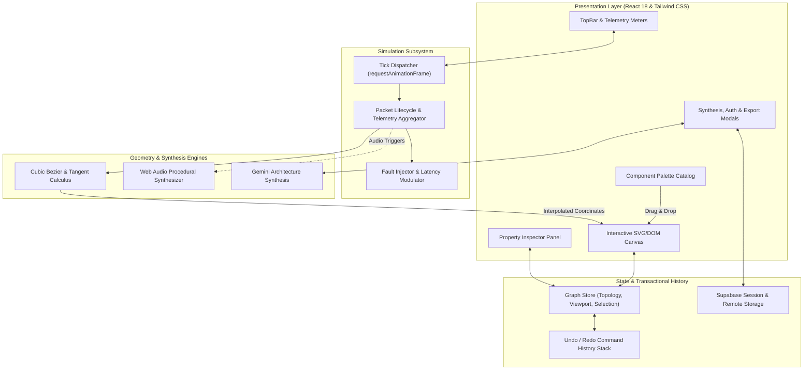

<div align="center">

# GraphFlow

**Interactive distributed systems modeler and real-time data flow simulator.**

[](LICENSE)
[](https://www.typescriptlang.org/)
[](https://react.dev/)
[](https://vite.dev/)
[](https://tailwindcss.com/)
[](https://github.com/Hanubaki/GraphFlow)

<p align="center">
  <a href="#overview">Overview</a> •
  <a href="#architecture">Architecture</a> •
  <a href="#core-capabilities">Capabilities</a> •
  <a href="#architecture-archetypes">Archetypes</a> •
  <a href="#getting-started">Getting Started</a> •
  <a href="#testing--verification">Testing</a> •
  <a href="#directory-structure">Structure</a> •
  <a href="#license">License</a>
</p>

</div>

---

## Overview

Static diagramming tools (such as draw.io, Lucidchart, and Miro) represent system topologies as inert boxes and lines. They do not simulate dynamic runtime characteristics:

- Downstream saturation and latency compounding when ingress traffic scales
- Backpressure propagation through asynchronous event buffers (such as Apache Kafka and RabbitMQ)
- Cascading timeouts, circuit-breaker tripping, and cache-miss stampedes under degraded node states

GraphFlow models distributed architectures as dynamic, stateful topologies with an integrated client-side simulation engine. Topologies are composed on an infinite canvas, connected through cubic bezier paths, and evaluated with simulated traffic streams. Packets traverse edges according to computed velocities and latency curves, with real-time aggregation of throughput (requests per second), network jitter, error rates, and dropped payloads.

---

## Core Capabilities

### Native Vector Calculus & De Casteljau Evaluation
All edge curves and packet positions are evaluated using pure Bernstein polynomial forms of cubic bezier curves:

$$B(t) = (1-t)^3 P_0 + 3(1-t)^2 t P_1 + 3(1-t) t^2 P_2 + t^3 P_3, \quad t \in [0, 1]$$

Coordinates, tangents, and normal vectors are computed directly against native SVG paths and DOM elements. The implementation avoids heavy third-party canvas runtimes (such as PixiJS, Fabric.js, or Konva), keeping initial asset payload minimal and maintaining 60 FPS frame rates.

### Decoupled Simulation Loop
Simulation mechanics run on a non-blocking `requestAnimationFrame` tick loop separated from React's component reconciliation cycle:
- **Packet Lifecycle Management:** Ingress queues, velocity calculations, and arrival callbacks are scheduled and resolved per tick.
- **Real-Time Telemetry:** Continuous rolling calculations for aggregate RPS, average end-to-end latency, and jitter variance.

### Fault Injection & Chaos Testing
- **Per-Node Degradation:** Configure latency overhead and failure probability ($[0.0, 1.0]$) across individual compute or storage nodes.
- **Error Packet Routing:** Requests failing status checks transition to 5xx error states and highlight retry loops or dead-letter sinks.
- **Traffic Modulation:** Inject instantaneous burst spikes to analyze queue saturation and node backpressure.

### Topology Synthesis
Natural language specification synthesis powered by the Gemini API, backed by a deterministic client-side heuristic engine when running offline or without credentials.

### Procedural Audio Feedback
Synthesizes acoustic feedback for connection bindings, traffic bursts, and node dropouts via the Web Audio API (sine/square oscillator nodes with configurable ADSR envelopes) without external audio assets.

### Specification & Mermaid Export
Generate self-contained Markdown architecture documents with embedded, standards-compliant Mermaid sequence and flowchart definitions for version-controlled documentation.

---

## Architecture



---

## Architecture Archetypes

GraphFlow includes verified archetypes modeling common distributed patterns:

| Archetype | Topology & Nodes | Simulated Characteristics |
| :--- | :--- | :--- |
| **E-Commerce Distributed System** | Client $\rightarrow$ API Gateway $\rightarrow$ Order/Auth Services $\rightarrow$ Redis $\rightarrow$ Kafka $\rightarrow$ Payment Worker $\rightarrow$ Stripe | Cache hit/miss latency divergence, async queue buffering, payment gateway latency. |
| **AI Retrieval-Augmented Pipeline** | Client $\rightarrow$ FastAPI Gateway $\rightarrow$ Vector Database $\rightarrow$ Gemini LLM $\rightarrow$ Object Storage | Vector similarity lookup delay, token generation latency, object storage persistence. |
| **Real-Time WebSocket Cluster** | Web & Mobile Clients $\rightarrow$ HAProxy Balancer $\rightarrow$ Socket Nodes $\rightarrow$ Redis Pub/Sub | High-frequency bidirectional streams, fan-out propagation, broker synchronization. |
| **Resilient Microservices Mesh** | Edge Gateway $\rightarrow$ Service Mesh $\rightarrow$ Microservices with Circuit Breaker routes | Dynamic error simulation, fallback route execution, backoff retry cadence. |

---

## Getting Started

### Prerequisites
- Node.js 18.0.0 or higher
- npm, pnpm, or yarn

### Installation

```bash
# Clone repository
git clone https://github.com/Hanubaki/GraphFlow.git

# Enter workspace
cd GraphFlow

# Install dependencies
npm install

# Configure environment variables (optional)
cp .env.example .env.local

# Run development server
npm run dev
```

The application will be available at `http://localhost:5173`.

---

## Testing & Verification

The test suite runs on **Vitest** with **React Testing Library** and covers mathematical evaluation, viewport logic, and security constraints:

```bash
# Execute test suite
npm test

# Run tests in watch mode
npm run test:watch
```

### Coverage Domains:
- **Geometry Calculus:** Verification of De Casteljau bezier interpolation, normal/tangent evaluations, and anchor point alignment.
- **Viewport Constraints:** Bounded zooming ($0.3\times$ to $2.5\times$), infinite pan transformations, and auto-centering calculations.
- **Security & Sanitization:** Content Security Policy (CSP) enforcement, export serialization sanitization, and webhook signature verification.
- **Export Specifications:** Validation of emitted Mermaid syntax and Markdown specification generation.

---

## Directory Structure

```
GraphFlow/
├── api/                     # Serverless endpoints and webhook handlers
├── src/
│   ├── components/
│   │   ├── Canvas/          # Canvas surface, node components, bezier connection lines
│   │   ├── Common/          # Shared atomic indicators, badges, and icons
│   │   ├── Embed/           # Standalone embed view for iframes and external docs
│   │   ├── Inspector/       # Contextual node and edge property configuration
│   │   ├── Landing/         # Landing presentation and archetype previews
│   │   ├── Modals/          # AI generator, export, billing, and auth dialogues
│   │   ├── Sidebar/         # Draggable catalog palette
│   │   └── Toolbar/         # Telemetry indicators, playback, and viewport actions
│   ├── constants/           # Component catalogs, archetypes, and default topologies
│   ├── context/             # Authentication and persistent storage providers
│   ├── hooks/               # useGraphStore (state), useSimulation (physics loop)
│   ├── services/            # Gemini API integration, Supabase client, persistence
│   ├── test/                # Unit and integration test suites
│   ├── types/               # Strict TypeScript domain interfaces
│   ├── utils/               # Bezier calculus, Web Audio synthesis, Mermaid export
│   ├── App.tsx              # Application layout and routing
│   └── main.tsx             # DOM mount point
├── index.html               # Document shell and metadata
├── package.json             # Build scripts and dependency manifest
├── tailwind.config.js       # Design tokens and styling configuration
├── tsconfig.json            # Strict TypeScript compiler options
└── vite.config.ts           # Bundler and test runner configuration
```

---

## Keyboard Shortcuts

| Shortcut (Windows / Linux) | Shortcut (macOS) | Action |
| :--- | :--- | :--- |
| <kbd>Ctrl</kbd> + <kbd>Z</kbd> | <kbd>Cmd</kbd> + <kbd>Z</kbd> | Undo last action |
| <kbd>Ctrl</kbd> + <kbd>Y</kbd> | <kbd>Cmd</kbd> + <kbd>Shift</kbd> + <kbd>Z</kbd> | Redo action |
| <kbd>Delete</kbd> / <kbd>Backspace</kbd> | <kbd>Backspace</kbd> | Remove selected node or connection |
| <kbd>Esc</kbd> | <kbd>Esc</kbd> | Clear selection / Dismiss active modal |
| <kbd>Space</kbd> + <kbd>Drag</kbd> | <kbd>Space</kbd> + <kbd>Drag</kbd> | Pan canvas viewport |
| <kbd>Mouse Wheel</kbd> | <kbd>Trackpad Pinch</kbd> | Zoom canvas viewport ($0.3\times$ to $2.5\times$) |

---

## Author

**Berke Akdemir**
- GitHub: [@Hanubaki](https://github.com/Hanubaki)
- Repository: [Hanubaki/GraphFlow](https://github.com/Hanubaki/GraphFlow)

Issues and pull requests are tracked through the [GitHub issue tracker](https://github.com/Hanubaki/GraphFlow/issues).

---

## License

This project is licensed under the [MIT License](LICENSE).
