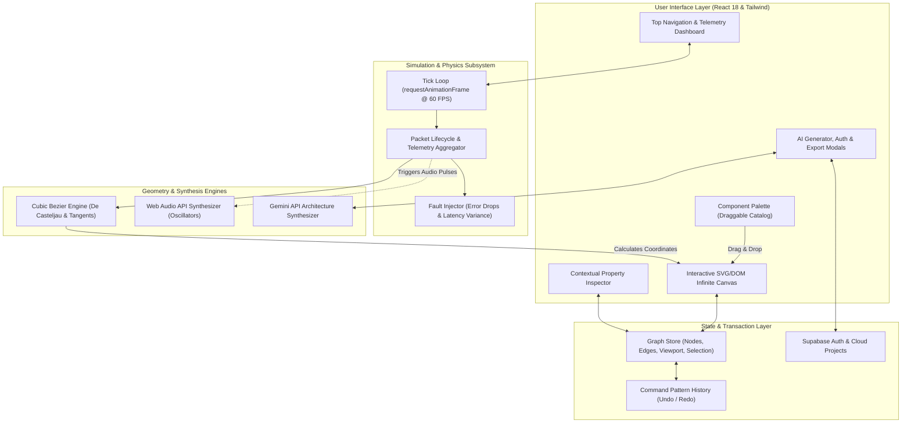

<div align="center">

# ⚡ GraphFlow

### Interactive Distributed Architecture & Real-Time Data Flow Simulator

[](https://reactjs.org/)
[](https://www.typescriptlang.org/)
[](https://vitejs.dev/)
[](https://tailwindcss.com/)
[](https://vitest.dev/)
[](#-pure-native-mathematics)
[](https://opensource.org/licenses/MIT)

<p align="center">
  <b>Stop drawing dead, static boxes. Simulate live traffic, latency bottlenecks, and network chaos in real-time at 60 FPS — directly inside your browser.</b>
</p>

[Architecture Overview](#-architecture--data-flow) · [Key Features](#-key-features) · [Quick Start](#-quick-start) · [Project Structure](#-project-structure) · [Report Bug](https://github.com/Hanubaki/GraphFlow/issues) · [Request Feature](https://github.com/Hanubaki/GraphFlow/issues)

</div>

---

## 💡 Why GraphFlow?

Traditional system architecture tools (draw.io, Lucidchart, Miro) produce **static diagrams**. While useful for high-level overviews, they suffer from a fundamental limitation: **they cannot model dynamic behavior**.

* What happens to downstream databases when traffic surges from 500 to 10,000 RPS?
* How does latency degrade across a microservice cascade when a Redis cache fails?
* Where do network bottlenecks accumulate when an asynchronous Kafka pipeline experiences backpressure?

**GraphFlow bridges the gap between static design and real-time simulation.** It combines an intuitive drag-and-drop infinite canvas with a decoupled, high-frequency simulation engine. You can model gateways, services, queues, and databases, dial up traffic volumes, inject chaos faults, and watch data packets stream across native cubic bezier curves with live telemetry.

---

## 🌟 Key Features

### 🧮 Pure Native Mathematics
* **Zero Heavy Canvas Dependencies:** Built entirely with native SVG paths and DOM transformations without bundling bulky canvas runtimes (Konva, Pixi, Fabric, or Three.js).
* **De Casteljau Bezier Calculus:** Smooth, dynamic cubic bezier splines ($B(t)$ polynomial evaluation) computed in real time for connection paths, control points, and tangent vectors.

### ⏱️ Decoupled 60 FPS Simulation Loop
* **Non-Blocking Physics:** Runs on a dedicated `requestAnimationFrame` tick loop, computing packet locations, interpolation factors ($t \in [0, 1]$), and packet arrival events independently from React re-renders.
* **Live Telemetry & Meters:** Real-time calculation of overall system throughput (RPS), average round-trip latency, jitter variance, and packet loss ratios.

### 💥 Chaos Engineering & Fault Injection
* **Node-Level Error & Latency Tuning:** Configure specific error rates (0%–100%) and processing delays on any individual node.
* **Visual Error Cascading:** Failed requests morph into distinct visual error packets (HTTP 500) and route toward retry pipelines or dead-letter queues.
* **Traffic Spikes:** Instant burst injection to test downstream resilience and backpressure thresholds.

### 🤖 AI-Powered Architecture Generator
* **Prompt to Architecture:** Natural language architecture generation powered by the Google Gemini API (with an automated offline heuristic synthesis fallback).
* **Instant Scaffolding:** Describe your requirements (e.g., *"Event-driven IoT telemetry pipeline with Kafka and TimescaleDB"*) and GraphFlow automatically synthesizes nodes, connections, and latency configurations.

### 🎵 Tactile Procedural Sound Synthesis
* **Web Audio API Engine:** Generates lightweight, procedural sound effects (sine/square wave oscillators with custom ADSR envelopes) for connection snaps, packet bursts, and critical errors — zero external audio files required.

### 📄 One-Click Export & Mermaid Generator
* **Engineering-Ready Documentation:** Instant export to clean Markdown specifications with embedded GitHub-compatible Mermaid flowcharts.
* **JSON Schema Persistence:** Save, load, and share graph architectures locally or to the cloud via Supabase integration.

---

## 🛠️ Architecture & Data Flow



---

## 🏛️ Pre-Configured Architectural Archetypes

GraphFlow ships with production-grade architectural templates ready for immediate exploration:

| Archetype | Topology & Components | Simulated Behaviors |
| :--- | :--- | :--- |
| **🛒 E-Commerce Distributed Cluster** | Client $\rightarrow$ API Gateway $\rightarrow$ Order/Auth Services $\rightarrow$ Redis $\rightarrow$ Kafka $\rightarrow$ Payment Worker $\rightarrow$ Stripe | Cache hits/misses, async event queuing, third-party payment latency. |
| **🤖 AI RAG Pipeline** | Web App $\rightarrow$ FastAPI Gateway $\rightarrow$ Vector Database (Pinecone) $\rightarrow$ Gemini LLM $\rightarrow$ S3 Storage | Embedding lookup latency, LLM token streaming delay, object store persistence. |
| **⚡ Real-Time WebSocket Pub/Sub** | Mobile & Web Clients $\rightarrow$ HAProxy Balancer $\rightarrow$ Node.js Socket Instances $\rightarrow$ Redis Pub/Sub Cluster | High-frequency bidirectional packets, horizontal fan-out, broker sync. |
| **🛡️ Microservices with Circuit Breaker** | Gateway $\rightarrow$ Service Mesh $\rightarrow$ Microservices with Fallback routes | Dynamic error simulation, failover routing, retry backoff behavior. |

---

## 🚀 Quick Start

### Prerequisites
* **Node.js**: v18.0.0 or higher
* **Package Manager**: `npm`, `pnpm`, or `yarn`

### Installation

```bash
# 1. Clone the repository
git clone https://github.com/Hanubaki/GraphFlow.git

# 2. Navigate to project directory
cd GraphFlow

# 3. Install dependencies
npm install

# 4. (Optional) Configure environment variables
cp .env.example .env.local

# 5. Start the development server
npm run dev
```

Open your browser and navigate to `http://localhost:5173`.

---

## 🧪 Automated Testing & Verification

GraphFlow includes a test suite built with **Vitest** and **React Testing Library**, verifying mathematical precision, responsive viewport behavior, and security boundaries:

```bash
# Run the complete test suite
npm test

# Run tests in watch mode
npm run test:watch
```

### Verified Test Domains:
* **Geometry Engine:** De Casteljau bezier interpolation, tangent vector calculations, and boundary bounding box collisions.
* **Viewport Constraints:** Canvas panning boundaries, responsive zoom limits ($30\%$ to $250\%$), and viewport auto-centering algorithms.
* **Security Hardening:** Enterprise Content Security Policy (CSP), export data sanitization (XSS prevention), and webhook payload verification.
* **Export Engine:** Mermaid syntax validity and formatted Markdown architecture document generation.

---

## 📂 Project Structure

```
GraphFlow/
├── .agent/                  # Antigravity agent configuration & engineering skills
├── api/                     # Serverless API routes (webhooks & background processing)
├── src/
│   ├── components/
│   │   ├── Canvas/          # GraphCanvas, NodeComponent, ConnectionLine, GridBackground
│   │   ├── Common/          # NodeIcon, StatusBadge, Tooltips
│   │   ├── Embed/           # Lightweight iframe embed view
│   │   ├── Inspector/       # Contextual node & edge property inspector
│   │   ├── Landing/         # Marketing hero and feature preview
│   │   ├── Modals/          # AI Generator, Export, Pricing, Templates, Auth
│   │   ├── Sidebar/         # Draggable node palette catalog
│   │   └── Toolbar/         # TopBar, telemetry meters, and canvas controls
│   ├── constants/           # Node definitions, catalog metadata, default templates
│   ├── context/             # Supabase AuthContext & state providers
│   ├── hooks/               # useGraphStore (state), useSimulation (physics loop)
│   ├── services/            # Gemini AI service, Supabase cloud client, storage
│   ├── test/                # Vitest unit & integration test suites
│   ├── types/               # Strict TypeScript domain models (graph, nodes, packets)
│   ├── utils/               # Bezier geometry, Web Audio synthesizer, Mermaid exporter
│   ├── App.tsx              # Root application router & layout
│   └── main.tsx             # Application bootstrap & DOM mount
├── index.html               # Main HTML entry with responsive viewport & meta tags
├── package.json             # Scripts & dependencies
├── tailwind.config.js       # Modern dark-mode palette & glassmorphism utilities
├── tsconfig.json            # Strict TypeScript configuration
└── vite.config.ts           # Vite bundler configuration & test runner setup
```

---

## ⌨️ Keyboard Shortcuts & Ergonomics

| Shortcut (Win / Linux) | Shortcut (macOS) | Action |
| :--- | :--- | :--- |
| <kbd>Ctrl</kbd> + <kbd>Z</kbd> | <kbd>Cmd</kbd> + <kbd>Z</kbd> | **Undo** last canvas or property action |
| <kbd>Ctrl</kbd> + <kbd>Y</kbd> | <kbd>Cmd</kbd> + <kbd>Shift</kbd> + <kbd>Z</kbd> | **Redo** previously undone action |
| <kbd>Delete</kbd> / <kbd>Backspace</kbd> | <kbd>Backspace</kbd> | **Delete** selected node or connection line |
| <kbd>Esc</kbd> | <kbd>Esc</kbd> | **Deselect** all active elements / Close modal |
| <kbd>Space</kbd> + <kbd>Click Drag</kbd> | <kbd>Space</kbd> + <kbd>Click Drag</kbd> | **Pan** across the infinite canvas |
| <kbd>Mouse Wheel</kbd> | <kbd>Trackpad Pinch</kbd> | **Zoom in / out** (bounded: $0.3\times$ to $2.5\times$) |

---

## 👨‍💻 Author

**Berke Akdemir**
* GitHub: [@Hanubaki](https://github.com/Hanubaki)
* Repository: [Hanubaki/GraphFlow](https://github.com/Hanubaki/GraphFlow)

Contributions, feature suggestions, and bug reports are welcome! Feel free to open an [issue](https://github.com/Hanubaki/GraphFlow/issues) or submit a pull request.

---

## 📄 License

This project is open-source and licensed under the [MIT License](LICENSE).
